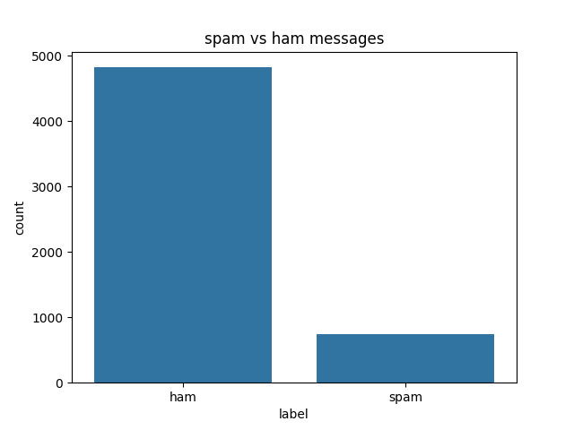
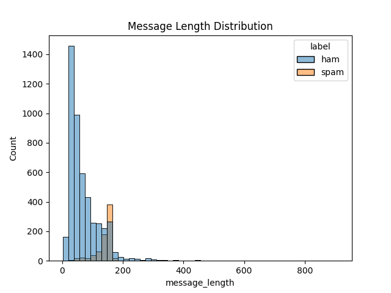
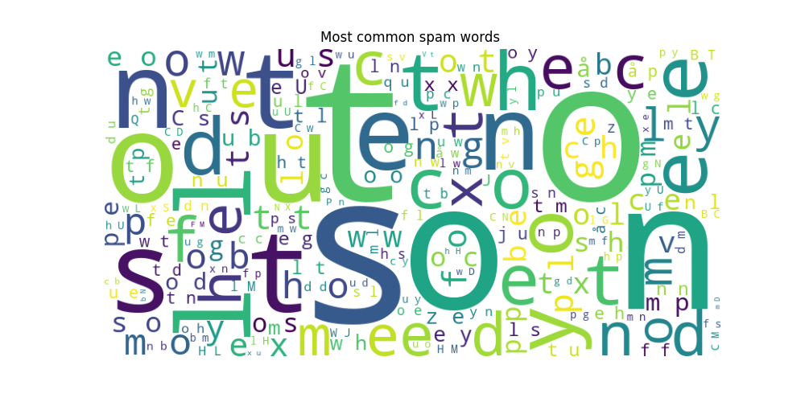

# Spam Message Detection Analysis

This project performs analysis on spam and ham messages using Python.

## Features
- Data Cleaning
- Spam vs Ham Visualization
- Message Length Analysis
- WordCloud Visualization

## Technologies Used
- Python
- Pandas
- Matplotlib
- Seaborn
- WordCloud

## Output Visualizations

### Spam vs Ham

### Message Length Distribution

### Spam WordCloud
